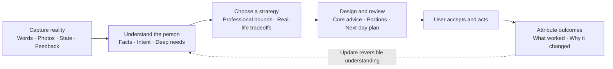
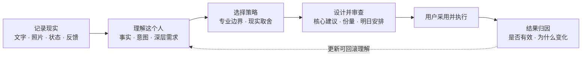

# MealCircuit

<p align="right"><strong><a href="#english">English</a> | <a href="#zh-cn">简体中文</a></strong></p>

**Local-first long-horizon meal feedback workbench. Capture facts. Keep the context. Calibrate the next choice.**

<p>
  <a href="https://github.com/QianQIUlp/meal-circuit/releases/tag/v0.3.0"></a>
  
  <a href="https://github.com/QianQIUlp/meal-circuit/actions/workflows/test.yml"></a>
  <a href="LICENSE"></a>
</p>

<a id="english"></a>

## English

MealCircuit is a **local-first, agent-in-the-loop** workbench for long-horizon meal feedback. It connects meal photos, raw ingredients, daily status check-ins, the food nutrition library, and user corrections into a traceable feedback loop, then combines the last 14 days of trends, long-term memory, and personal doctrine to produce structured judgments and a next-day meal plan.

> [!IMPORTANT]
> MealCircuit does not require an API key by default. It stores facts, assembles context, and validates results; Codex, Claude Code, or another agent can still perform the analysis. Optionally, you can configure your own OpenAI, Anthropic, or DeepSeek API key in environment variables and manually trigger built-in generation for pending work.

## More Than Calorie Logging

| Evidence First | Context First | Sovereignty First |
| :--- | :--- | :--- |
| Oils, sauces, weights, and brands that are not visible in a photo are explicitly marked as unknown instead of being faked into precision. | Every judgment reads the personal doctrine, the last 14 days of records, long-term memory, and current adjustments instead of evaluating one meal in isolation. | Data lives by default in a local SQLite directory outside the repo, with no account, no telemetry, and no default cloud sync. |

## Get Running in Three Minutes

Requirements: **Python 3.11+**. Install the base package in a virtual environment; on Windows this also supplies the IANA timezone database used by non-UTC profiles. Sync, desktop packaging and the reference server remain separate optional dependency sets.

```powershell
git clone https://github.com/QianQIUlp/meal-circuit.git
cd meal-circuit

python -m venv .venv
.\.venv\Scripts\Activate.ps1
python -m pip install -e .
python -m mealcircuit.agent_cli init
python -m mealcircuit.agent_cli doctor
.\start.ps1
```

Open [http://127.0.0.1:8765](http://127.0.0.1:8765). The first run guides you through goals, safety boundaries, training needs, and per-meal preparation preferences. `doctor` shows the private data location; stop the server with `Ctrl+C`.

## Install v0.3.0

Prebuilt applications are available from the [v0.3.0 release](https://github.com/QianQIUlp/meal-circuit/releases/tag/v0.3.0). Choose the asset for your platform rather than trying to run an Android bundle or a Linux AppImage on another system.

| Platform | Asset | What to do |
| :--- | :--- | :--- |
| Windows x64 | `MealCircuit-0.3.0-windows-x64-setup.exe` or `MealCircuit-0.3.0-windows-x64-portable.zip` | Run the installer, or extract the ZIP and launch `MealCircuit.exe`. The current Windows artifacts are runnable but not Authenticode-signed, so Windows may show `Unknown Publisher`. |
| Linux x86_64 | `MealCircuit-0.3.0-linux-x86_64.AppImage` | Download it, run `chmod +x MealCircuit-0.3.0-linux-x86_64.AppImage`, then launch it. |
| Android 8.0+ | `app-release.apk` or `app-release.aab` | Install the signed APK directly. The AAB is for Play Console or another bundle distributor and is not installed directly on a device. |
| macOS | `MealCircuit-0.3.0-macos-universal.dmg` | The universal DMG supports Apple silicon and Intel Macs. It is ad-hoc signed and not notarized, so Gatekeeper may require a deliberate user override. |

Download `SHA256SUMS.txt` with the asset and verify it before opening the file. On Linux, run `sha256sum -c SHA256SUMS.txt --ignore-missing` in the download directory; on Windows, compare `Get-FileHash <file> -Algorithm SHA256` with the matching entry. See the [full v0.3.0 release notes](docs/releases/v0.3.0.md) for signing and recovery boundaries.

## How It Works



Daily planning cannot be published from one model response. It must account for every user-authored input, formulate the case, establish professional boundaries, compare realistic strategies, design a plan, and pass independent review. Structural checks remain a safety floor; they cannot invent shopping or ingredient-reuse needs merely to fill fields. Pending task text can be edited with prior versions retained; completed facts stay locked and corrections are appended.

## Product Surface

| Entry | Problem it solves |
| :--- | :--- |
| **Today** | See today's arrangement, record changes, answer only relevant state questions, and negotiate tomorrow's draft |
| **Plans** | See today's, tomorrow's, and past arrangements; record outcomes or adjust one meal when conditions change |
| **Me** | Manage goals and meal preferences, review the user understanding currently affecting plans, update inventory, and open advanced settings |

The top bar keeps one shortcut: **Record**. Photos, ingredient analysis, and inventory updates are secondary capture methods. Task queues, raw context, rule/experiment machinery, calibration eligibility, versions, and source manifests remain available to the system but are not part of the ordinary navigation.

The daily menu always covers breakfast, lunch, dinner, a conditional snack, training-day adjustments, and gut-symptom adjustments. During onboarding, each person chooses `home_cook`, `quick_assembly`, or `eat_out` separately for breakfast, lunch, and dinner; this is stored in their versioned personal strategy rather than fixed by repository defaults. Every home-cooked meal gets its own beginner-friendly single-serving execution card, while shopping, online filtering, and three-day ingredient reuse remain coordinated across the day. The system reads recent completed home meals by meal slot plus likely carryover ingredients and rotates dishes and flavor profiles independently for each slot.

A next-day per-meal answer can temporarily override those defaults for one date. `day-context.meal_mode_resolution` records the defaults, explicit overrides, effective modes, target date, and question version. An `eat_out` meal renders concrete protein/staple/vegetable/sauce guidance and cannot contain a home recipe; unanswered meals inherit the personal strategy, and legacy `mixed` answers are not guessed.

“Today Status” shows five daily modules by default. You answer one question at a time, and single-question drafts are preserved automatically; only after a full module is completed do its answers enter the agent context and re-queue the daily review. Modules can be hidden, reordered, or switched to on-demand recording in “Adjust Modules”. An explicit skip only means the user did not provide the information; the system does not infer “no training” or “no symptoms” from that.

## Independent Devices and Optional Sync

MealCircuit 0.3 adds a full native Android client while keeping the Python desktop client. Both are offline-first: their local SQLite/Room database is the only UI read/write source, and all features remain usable without an account or sync server. Android does not embed Python.

Users may optionally enter any compatible self-hosted Sync v1 HTTPS URL. The open-source FastAPI/PostgreSQL service stores only opaque account/device metadata, encrypted revisions and encrypted photo chunks; business logic, AI calls, conflict resolution and materialized views stay on devices. Each device configures its own model provider and API key.

```powershell
# Encrypted portable backup (prints a separate one-time recovery string)
python -m mealcircuit.agent_cli export-data --output backup.mcx

# Configure or create a self-hosted sync account interactively
python -m mealcircuit.agent_cli sync-configure --server-url https://sync.example.com `
  --login-name me --device-name desktop --register
python -m mealcircuit.agent_cli sync-now
```

Recovery strings are not passwords: losing every device and the recovery string makes remote ciphertext unrecoverable. See [Domain v1](docs/domain-v1.md), [Portable Data](docs/portable-data-v1.md), [Sync protocol](docs/sync-protocol-v1.md), [self-hosting](sync_server/README.md), [Android](android/README.md), the [acceptance matrix](docs/multidevice-acceptance.md) and the [threat model](docs/threat-model.md).

## Agent Workflow

Pending work is read from the CLI. Photos and raw ingredients use task context. Daily date context is read-only; every new daily result must go through a mandatory Agent run.

The adaptive loop is available in both Web and CLI. First use creates a resumable, versioned goal and safety contract. The Today page then runs a longitudinal case workflow: capture what changed, formulate the person's current situation, ask at most three decision-changing questions, design a draft, and review it independently. A draft is replaceable and invisible to formal history until the user accepts it. Published plan items receive stable IDs; actual execution is appended as versioned feedback.

An explicit, low-risk long-term need takes effect immediately as a visible, reversible understanding; one implicit signal waits for confirmation and two independent real-world signals may activate it. A model's own repeated guess is never evidence. Goals, safety mode, allergies, health states, nutrition targets and other restrictive rules still require explicit confirmation in the profile. See [Agent Workbench](docs/agent-workbench.md) for the button-to-outcome flow, context boundaries, learning lifecycle and failure behavior.

```powershell
# 1. List pending photo, ingredient, and daily review work
python -m mealcircuit.agent_cli pending

# 2a. Process a photo / ingredient task
python -m mealcircuit.agent_cli context <TASK_ID> --output context.json
python -m mealcircuit.agent_cli schema photo
python -m mealcircuit.agent_cli complete <TASK_ID> --file result.json

# Optional: use your configured API key to generate and complete the task
python -m mealcircuit.agent_cli generate <TASK_ID>

# 2b. Process a daily review through the mandatory Agent run.
# begin / next return a private workspace under MEALCIRCUIT_HOME/agent-runs/<RUN_ID>/.
python -m mealcircuit.agent_cli agent-run begin 2026-01-01
# Edit the returned result_file, then submit without a repository-local JSON file.
# Repeat submit for the returned stage until all seven receipts are complete:
python -m mealcircuit.agent_cli agent-run submit <RUN_ID> --stage <STAGE>
python -m mealcircuit.agent_cli agent-run finalize <RUN_ID>
python -m mealcircuit.agent_cli agent-run accept <RUN_ID>

# Optional: use your configured API key to run every stage and prepare an unpublished draft
python -m mealcircuit.agent_cli day-generate 2026-01-01

# 3. Append a user-confirmed correction without overwriting the original result
python -m mealcircuit.agent_cli correct <TASK_ID> --text "User-confirmed correction"

# Adaptive loop and portable backup
python -m mealcircuit.agent_cli agent-intake 2026-01-01 --text "Training ran late; dinner felt too small."
python -m mealcircuit.agent_cli agent-context 2026-01-01 --output agent-context.json
python -m mealcircuit.agent_cli agent-draft 2026-01-01
python -m mealcircuit.agent_cli agent-state 2026-01-01
# After answering any returned question: agent-answer <QUESTION_ID> --file answer.json --version N
python -m mealcircuit.agent_cli agent-revise 2026-01-01 --text "Change lunch to eating out; keep dinner."
python -m mealcircuit.agent_cli agent-accept 2026-01-01
python -m mealcircuit.agent_cli user-model list
python -m mealcircuit.agent_cli setup status
python -m mealcircuit.agent_cli plan 2026-01-02
python -m mealcircuit.agent_cli questions list 2026-01-02
python -m mealcircuit.agent_cli learning list
python -m mealcircuit.agent_cli inventory list
python -m mealcircuit.agent_cli calibration
# Experiment JSON: {"action":"...","success_signal":"..."}
python -m mealcircuit.agent_cli learning experiment-propose dinner_active_minutes --file experiment.json
python -m mealcircuit.agent_cli export-bundle --output mealcircuit-backup.zip
python -m mealcircuit.agent_cli import-bundle mealcircuit-backup.zip
```

Agents should strictly follow `doctrine.content` and `result_schema` in the exported context. Daily reviews must also read `target_checkin`, `checkin_coverage`, and `recent_checkins`; drafts are not exported, and skips or missing answers remain unknown. Photo analysis uses nutrition ranges; any range that cannot be judged is `null`, and invisible details go into `unknowns`.

### Optional API Key Generation

Built-in generation is opt-in. You can enable it from **Me → Advanced settings → Intelligent planning**, or set environment variables before starting the server. Photo and ingredient task generation remains manual; the Today workbench debounces new facts for 30 seconds and then runs facts, intent learning, case formulation, professional boundaries, strategy comparison, plan design and independent review before creating an unpublished draft. Use `MEALCIRCUIT_AI_PROVIDER` with `openai`, `anthropic`, or `deepseek`, set `MEALCIRCUIT_AI_MODEL` to the exact model you want to pay for, and provide `MEALCIRCUIT_OPENAI_API_KEY`, `MEALCIRCUIT_ANTHROPIC_API_KEY`, or `MEALCIRCUIT_DEEPSEEK_API_KEY`. Optional `MEALCIRCUIT_AI_CASE_MODEL`, `MEALCIRCUIT_AI_PLAN_MODEL`, and `MEALCIRCUIT_AI_REVIEW_MODEL` values override the shared model for advanced routing. The Web UI stores keys only in the current Python process environment; it does not write them to SQLite, config files, logs, or the page, and restarting the service clears them.

DeepSeek uses its OpenAI-compatible Chat API path. As of the current official DeepSeek API docs, MealCircuit supports DeepSeek for text-only ingredient and daily-review generation; photo tasks still need a provider with documented image input.

When you click the generation action in the Web UI or run `generate` / `day-generate`, MealCircuit sends only the context for the current task or Agent stage, and for photo tasks the uploaded image, to the selected model provider. Daily generation cannot publish one model response directly: every mandatory stage must produce a receipt, the final plan must pass independent review, and the user must accept the draft.

Daily menus also pass a deterministic semantic rotation gate derived from real dish names, ingredients, seasonings, and cooking steps. Renaming a dish or changing model-supplied rotation labels cannot hide a duplicate. Built-in generation retries a rejected in-memory candidate up to twice; failed candidates never become review history. A plan for today or the future remains replaceable in place until it receives execution feedback, rescue activity, or learning references. Past or evidence-bearing plans are locked and revisions become formal history.

When any meal is home-cooked, `day-context` also includes versioned `meal_modes`, `home_cooking_preferences`, `recent_home_meals` (plus the legacy dinner alias), `recent_online_categories`, `ingredient_carryover_obligations`, and the generation protocol. `ingredient_carryover_obligations` is derived from previous three-day reuse plans where required ingredients may have been bought and are still inside the reuse window; agent results must cover each item in `ingredient_carryover_decisions` as `use`, `skip`, or `discard`. Online shopping advice only describes specs, ingredient filters, and search keywords; it does not perform external lookups or claim real product prices or inventory.

## Data & Boundaries

Runtime data is never written into the source repository:

| System | Default private data directory |
| :--- | :--- |
| Windows | `%LOCALAPPDATA%\MealCircuit` |
| macOS | `~/Library/Application Support/MealCircuit` |
| Linux | `$XDG_DATA_HOME/mealcircuit` or `~/.local/share/mealcircuit` |

Use `MEALCIRCUIT_HOME` to move the entire private directory, or `MEALCIRCUIT_DB` and `MEALCIRCUIT_PORT` to override the database path and port separately.

<details>
<summary><strong>Migrate safely from legacy DietOS</strong></summary>

Preview first, then apply the copy:

```powershell
python -m mealcircuit.agent_cli migrate-data --from-repo <OLD_REPO_PATH>
python -m mealcircuit.agent_cli migrate-data --from-repo <OLD_REPO_PATH> --apply
```

Migration only copies data and never deletes source files; the database uses the SQLite Backup API and verifies integrity, table row counts, and logical summaries.

</details>

### Current Real Boundaries

- The Web UI listens on loopback only by default; `--allow-remote` does not add authentication or TLS and should not be exposed to the public internet.
- Photo and ingredient uploads only create pending work and are never recognized in the background. When a provider is explicitly configured, new Today facts may automatically refresh an unpublished meal-plan draft after the debounce window; formal plans still require user acceptance.
- Accounts exist only for optional synchronization. There is no official hosted cloud, iOS client, same-device fast account switching, multi-user shared profile, package OCR, or external nutrition database.
- E2EE protects the remote copy, not an unlocked local device. The cryptographic implementation has deterministic cross-language tests but no independent audit yet.
- If you use a cloud agent or optional API key generation, exported context and images may be sent to that model provider; decide based on its data policy.
- MealCircuit provides general-purpose logging and decision support, not medical diagnosis or treatment advice.

## Development & Verification

```powershell
.\test.ps1
python tools\release_check.py
```

Tests cover data persistence, explicit migrations, Portable Data round trips, cross-language Domain/crypto vectors, offline concurrency and conflicts, E2EE attachment recovery, key rotation, PostgreSQL CAS/idempotency, Android Room migration, context/result validation, HTTP critical paths, and open-source release boundaries. The local core remains usable without optional dependencies; desktop sync, Android and the self-hosted service use their locked platform dependencies.

```text
mealcircuit/   app, data, validation, service, and CLI
android/       full native Kotlin/Compose/Room client
protocol/      Domain v1 schema, fixtures, crypto vectors and Sync OpenAPI
sync_server/   opaque FastAPI/PostgreSQL E2EE relay
rules/         public core rules
templates/     private configuration bootstrap templates
tests/         unit and HTTP integration tests
tools/         pre-release privacy and boundary checks
```

## License

[MIT](LICENSE) · [Privacy Notice](PRIVACY.md) · [Security Policy](SECURITY.md) · [Contributing](CONTRIBUTING.md) · [Disclaimer](DISCLAIMER.md)

<a id="zh-cn"></a>

## 简体中文

MealCircuit 是一个**本地优先、Agent-in-the-loop** 的长期饮食反馈工作台。它把餐食照片、原材料、每日状态问答、食品营养库和用户更正串成一条可追溯的反馈回路，再结合近 14 天趋势、长期记忆与个人总纲，生成结构化判断和下一日菜单。

> [!IMPORTANT]
> MealCircuit 默认不要求 API Key。它负责保存事实、组装上下文和校验结果；Codex、Claude Code 或其他 Agent 仍可负责分析。你也可以选择在环境变量中配置自己的 OpenAI、Anthropic 或 DeepSeek API Key，并手动触发内置生成来处理待办。

## 不只是卡路里记录

| 证据优先 | 上下文优先 | 主权优先 |
| :--- | :--- | :--- |
| 照片中看不见的油、酱汁、重量和品牌会被明确标为未知，不用伪精确换取确定感。 | 每次判断都读取个人总纲、近 14 天记录、长期记忆和当前调整，不孤立评价某一餐。 | 数据默认保存在仓库外的本机 SQLite 目录；无账户、无遥测、无默认云同步。 |

## 三分钟启动

环境要求：**Python 3.11+**。先在虚拟环境中安装基础包；Windows 会同时安装非 UTC 档案所需的 IANA 时区数据库。同步、桌面打包与参考服务仍是分开的可选依赖组。

```powershell
git clone https://github.com/QianQIUlp/meal-circuit.git
cd meal-circuit

python -m venv .venv
.\.venv\Scripts\Activate.ps1
python -m pip install -e .
python -m mealcircuit.agent_cli init
python -m mealcircuit.agent_cli doctor
.\start.ps1
```

打开 [http://127.0.0.1:8765](http://127.0.0.1:8765)。首次使用会进入可恢复的目标与安全初始化；原有记录入口不会因初始化门禁消失。`doctor` 仍可查看私人数据位置；停止服务使用 `Ctrl+C`。

## 安装 v0.3.0

预编译应用见 [v0.3.0 Release](https://github.com/QianQIUlp/meal-circuit/releases/tag/v0.3.0)。请按系统选择对应资产，不要尝试在其他系统上直接运行 Android bundle 或 Linux AppImage。

| 平台 | 资产 | 使用方式 |
| :--- | :--- | :--- |
| Windows x64 | `MealCircuit-0.3.0-windows-x64-setup.exe` 或 `MealCircuit-0.3.0-windows-x64-portable.zip` | 运行安装器，或解压 ZIP 后启动 `MealCircuit.exe`。当前 Windows 产物可运行但没有 Authenticode 签名，Windows 可能提示 `Unknown Publisher`。 |
| Linux x86_64 | `MealCircuit-0.3.0-linux-x86_64.AppImage` | 下载后执行 `chmod +x MealCircuit-0.3.0-linux-x86_64.AppImage`，再启动它。 |
| Android 8.0+ | `app-release.apk` 或 `app-release.aab` | 直接安装已签名的 APK。AAB 用于上传 Play Console 或其他 bundle 分发渠道，不能直接安装到设备。 |
| macOS | `MealCircuit-0.3.0-macos-universal.dmg` | 通用 DMG 同时支持 Apple silicon 与 Intel Mac。它仅 ad-hoc 签名、未 notarize，Gatekeeper 可能要求用户明确放行。 |

请同时下载 `SHA256SUMS.txt`，并在打开文件前校验。Linux 可在下载目录运行 `sha256sum -c SHA256SUMS.txt --ignore-missing`；Windows 可用 `Get-FileHash <文件> -Algorithm SHA256` 对照对应条目。签名与恢复边界见 [v0.3.0 完整发行说明](docs/releases/v0.3.0.md)。

## 它如何工作



每日安排不能由一份模型回答直接发布。系统必须逐条处理用户输入，形成个案判断，建立专业边界，比较现实策略，设计计划并通过独立审查。结构校验只是安全底线，不能为了填满字段制造采购或食材复用需求。待处理任务的文字可以修改并保留旧版本；已完成事实保持锁定，用户更正作为新历史追加。

## 产品界面

| 入口 | 解决的问题 |
| :--- | :--- |
| **今天** | 查看今天怎么吃、记录变化、补充真正相关的状态，并协商明日草案 |
| **计划** | 集中查看今天、明天和过去的安排；记录执行结果或只调整临时变化的一餐 |
| **我的** | 管理目标与饮食偏好、MealCircuit 正在使用的用户理解、库存以及高级设置 |

顶栏只保留“记一笔”。照片、原材料和库存更新作为记录的附加方式；任务列表、原始上下文、规则实验、校准资格、版本和来源清单不再要求普通用户理解。

每日菜单固定覆盖早餐、午餐、晚餐、条件加餐、训练日调整和肠胃异常调整。初始化时，用户分别为早餐、午餐和晚餐选择“在家下厨”“快速组装”或“外食”；这些选择保存在版本化个人策略中，而不是写死在仓库默认配置里。每个在家下厨餐次都有独立的一人份新手执行卡，同时共享采购清单、网购筛选关键词和三日食材复用方向。系统按餐次读取近期已完成菜单并独立轮换菜式和主风味。

次日逐餐问答可以只覆盖某一天的默认方式。`day-context.meal_mode_resolution` 会保存长期默认、明确覆盖、最终有效方式、目标日期和问题版本。外食餐次直接显示蛋白、主食、蔬菜与酱汁选择规则，并禁止携带自炊菜谱；未指定餐次继续沿用个人策略，旧 `mixed` 答案不会被猜成具体餐次。

“今日状态”默认显示五个每日模块。每次只回答一个问题，单题草稿会自动保留；完成整个模块后，答案才会进入 Agent 上下文并重新排队当日复盘。模块可以在“调整模块”中隐藏、排序或改为按需记录。明确跳过只表示用户不提供，系统不会据此推断“未训练”或“没有症状”。

## 多端独立运行与可选同步

MealCircuit 0.3 新增完整 Kotlin 原生 Android 客户端，同时保留 Python 桌面客户端。两端都以本机 SQLite/Room 为唯一读写源：不注册、不联网、不同步也能完整使用；Android 不嵌入 Python。

用户可以自行填写任意兼容 Sync v1 的自托管 HTTPS 地址。开源 FastAPI/PostgreSQL 服务只保存不透明的账户/设备元数据、加密 revision 和加密照片分块；业务规则、AI 调用、冲突解决和界面投影都留在设备。每台设备独立配置模型 provider 与 API Key。

```powershell
# 加密便携备份；命令会另外显示一次性恢复字符串
python -m mealcircuit.agent_cli export-data --output backup.mcx

# 交互式创建自托管同步账户并立即同步
python -m mealcircuit.agent_cli sync-configure --server-url https://sync.example.com `
  --login-name me --device-name desktop --register
python -m mealcircuit.agent_cli sync-now
```

恢复字符串不是登录密码：如果所有设备和恢复字符串同时丢失，服务端密文按设计无法恢复。详细边界见 [Domain v1](docs/domain-v1.md)、[Portable Data](docs/portable-data-v1.md)、[同步协议](docs/sync-protocol-v1.md)、[自托管说明](sync_server/README.md)、[Android 工程](android/README.md)、[验收矩阵](docs/multidevice-acceptance.md)和[威胁模型](docs/threat-model.md)。

## Agent 工作流

待办统一从 CLI 读取。照片与原材料使用任务上下文；每日日期上下文只用于检查，新的每日结果必须经过完整 Agent 运行。

自适应闭环同时提供 Web 与 CLI。首次使用建立可恢复、带版本的目标与安全契约。此后“今天”按连续个案流程工作：记录变化 → 理解当前这个人 → 最多追问三条真正会改变方案的问题 → 设计草案 → 独立审查。草案可替换且不进入正式历史，用户接受后才发布成稳定计划项，真实执行继续以可追溯事件追加。

用户明确表达的低风险长期需求会立即成为可见、可撤回的理解；一次隐式信号只等待确认，两个独立真实信号后才可自动生效。模型重复自己的猜测不算证据。目标、安全模式、过敏、健康状态、营养目标及其他强限制仍必须在档案中明确确认。按钮会触发什么、上下文如何选择、学习怎样回滚及失败时保留什么，见 [Agent 工作台](docs/agent-workbench.md)。

```powershell
# 1. 查看照片、原材料与每日复盘待办
python -m mealcircuit.agent_cli pending

# 2a. 处理照片 / 原材料任务
python -m mealcircuit.agent_cli context <任务ID> --output context.json
python -m mealcircuit.agent_cli schema photo
python -m mealcircuit.agent_cli complete <任务ID> --file result.json

# 可选：使用已配置的 API Key 生成并完成任务
python -m mealcircuit.agent_cli generate <任务ID>

# 2b. 通过强制 Agent 流程处理每日复盘
# begin / next 会在 MEALCIRCUIT_HOME/agent-runs/<RUN_ID>/ 返回私人工作目录
python -m mealcircuit.agent_cli agent-run begin 2026-01-01
# 编辑返回的 result_file，然后直接提交；无需在仓库根目录创建 JSON
# 按返回顺序重复 submit，直到七个阶段全部完成
python -m mealcircuit.agent_cli agent-run submit <RUN_ID> --stage <STAGE>
python -m mealcircuit.agent_cli agent-run finalize <RUN_ID>
python -m mealcircuit.agent_cli agent-run accept <RUN_ID>

# 可选：使用已配置的 API Key 完成各阶段并生成未发布草案
python -m mealcircuit.agent_cli day-generate 2026-01-01

# 3. 追加用户确认的更正，不覆盖原始结果
python -m mealcircuit.agent_cli correct <任务ID> --text "用户确认的更正"

# 自适应回路与可迁移备份
python -m mealcircuit.agent_cli agent-intake 2026-01-01 --text "今天训练晚了，晚餐菜量偏少"
python -m mealcircuit.agent_cli agent-context 2026-01-01 --output agent-context.json
python -m mealcircuit.agent_cli agent-draft 2026-01-01
python -m mealcircuit.agent_cli agent-state 2026-01-01
# 有追问时：agent-answer <问题ID> --file answer.json --version N
python -m mealcircuit.agent_cli agent-revise 2026-01-01 --text "午饭改外食，晚饭保留"
python -m mealcircuit.agent_cli agent-accept 2026-01-01
python -m mealcircuit.agent_cli user-model list
python -m mealcircuit.agent_cli setup status
python -m mealcircuit.agent_cli plan 2026-01-02
python -m mealcircuit.agent_cli questions list 2026-01-02
python -m mealcircuit.agent_cli learning list
python -m mealcircuit.agent_cli inventory list
python -m mealcircuit.agent_cli calibration
# 实验 JSON：{"action":"...","success_signal":"..."}
python -m mealcircuit.agent_cli learning experiment-propose dinner_active_minutes --file experiment.json
python -m mealcircuit.agent_cli export-bundle --output mealcircuit-backup.zip
python -m mealcircuit.agent_cli import-bundle mealcircuit-backup.zip
```

Agent 应严格遵循上下文中的 `doctrine.content` 与 `result_schema`。每日复盘还必须读取 `target_checkin`、`checkin_coverage` 和 `recent_checkins`；草稿不会被导出，跳过与缺失保持未知。照片分析使用营养区间；无法判断的区间为 `null`，不可见信息进入 `unknowns`。

### 可选 API Key 生成

内置生成是用户主动启用的可选能力。照片/原材料任务仍需手动触发；“今天”工作台会在新事实停止变化 30 秒后自动准备一份尚未采用的安排。所有每日生成都会完成事实整理、意图与学习识别、个案理解、专业边界、策略比较、计划设计和独立审查，不能把一份模型回答直接发布。你可以在 **我的 → 高级设置 → 智能规划设置** 中启用，也可以在启动服务前设置环境变量。设置 `MEALCIRCUIT_AI_PROVIDER=openai|anthropic|deepseek`，用 `MEALCIRCUIT_AI_MODEL` 明确填写模型名，并提供对应 API Key；高级用法可分别设置 `MEALCIRCUIT_AI_CASE_MODEL`、`MEALCIRCUIT_AI_PLAN_MODEL` 与 `MEALCIRCUIT_AI_REVIEW_MODEL`。Web UI 只把 key 放进当前 Python 进程环境，不写入 SQLite、配置文件、日志或页面；重启服务后自动清空。

DeepSeek 走其 OpenAI-compatible Chat API。按当前官方 DeepSeek API 文档，MealCircuit 只用 DeepSeek 处理文本型原材料和每日复盘生成；照片任务仍需要选择有明确图片输入能力的 provider。

当你在 Web UI 点击“用 API Key 生成”或运行 `generate` / `day-generate` 时，MealCircuit 会把组装好的上下文发送给所选模型供应商；照片任务还会发送上传图片。模型返回的 JSON 仍必须通过本地结构校验和业务规则后才会保存。

每日菜单还会经过服务端确定性语义轮换门：从真实菜名、食材、调味和烹饪步骤生成指纹，改名或篡改模型填写的轮换标签不能掩盖重复。内置生成遇到候选重复会在内存中最多重试两次，失败候选不进入复盘历史。今天或未来的计划在没有执行回执、救场或学习引用前可原位替换；日期已过或已有真实证据后自动锁定，后续修订才形成正式历史。

维护者可先用 `python -m mealcircuit.agent_cli review-cleanup YYYY-MM-DD --expected-version N` 预览单日错误生成历史清理；只有证据门确认计划仍可替换时，追加 `--apply` 才会执行。该命令不会清理用户记录、状态问答或执行事实。

存在在家下厨餐次时，`day-context` 会提供版本化 `meal_modes`、`home_cooking_preferences`、`recent_home_meals`（并保留旧晚餐别名）、`recent_online_categories`、`ingredient_carryover_obligations` 和生成协议。`ingredient_carryover_obligations` 来自上一轮三日复用计划中可能已买且仍在复用窗口内的食材；Agent 必须在结果中用 `ingredient_carryover_decisions` 逐项说明使用、跳过或丢弃。网购建议只描述规格、配料筛选标准与搜索关键词，不执行外部查询，也不声称具体商品的价格或库存。

## 数据与边界

运行数据不会写入源码仓库：

| 系统 | 默认私人数据目录 |
| :--- | :--- |
| Windows | `%LOCALAPPDATA%\MealCircuit` |
| macOS | `~/Library/Application Support/MealCircuit` |
| Linux | `$XDG_DATA_HOME/mealcircuit` 或 `~/.local/share/mealcircuit` |

可用 `MEALCIRCUIT_HOME` 修改整个私人目录，或分别通过 `MEALCIRCUIT_DB` 与 `MEALCIRCUIT_PORT` 覆盖数据库路径和端口。

<details>
<summary><strong>从旧版 DietOS 安全迁移</strong></summary>

先预览，再执行复制：

```powershell
python -m mealcircuit.agent_cli migrate-data --from-repo <旧工程路径>
python -m mealcircuit.agent_cli migrate-data --from-repo <旧工程路径> --apply
```

迁移只复制数据，不删除源文件；数据库使用 SQLite Backup API，并校验完整性、表行数和逻辑摘要。

</details>

### 当前真实边界

- Web UI 默认只监听回环地址；`--allow-remote` 不会增加认证或 TLS，不建议暴露到公网。
- 照片和原材料上传只创建待办，不会在后台自动识别。用户明确配置 provider 后，“今天”的新事实会在防抖窗口结束后自动刷新未发布草案；正式计划仍需用户确认。
- 账户只服务于可选同步；首版不提供官方托管云、iOS、同设备快速切换账户、多人共享档案、包装 OCR 或外部营养数据库。
- E2EE 保护远端副本，不保护已解锁的本机；密码学实现已有跨语言确定性测试，但尚未接受独立第三方审计。
- 使用云端 Agent 或可选 API Key 生成时，上下文与图片可能发送给对应模型服务商，请按其数据政策判断。
- MealCircuit 提供一般性记录与决策支持，不构成医疗诊断或治疗建议。

## 开发与验证

```powershell
.\test.ps1
python tools\release_check.py
```

测试覆盖数据持久化、显式迁移、Portable Data 往返、跨语言 Domain/密码学向量、离线并发与冲突、E2EE 附件恢复、安全轮换、PostgreSQL CAS/幂等、Android Room 迁移、上下文与结果校验、HTTP 关键路径及开源发布边界。本地核心仍可无可选依赖运行；桌面同步、Android 与自托管服务使用锁定的平台依赖。

```text
mealcircuit/   应用、数据、校验、服务与 CLI
android/       完整 Kotlin / Compose / Room 原生客户端
protocol/      Domain v1、夹具、密码学向量与 Sync OpenAPI
sync_server/   不透明 FastAPI / PostgreSQL E2EE 中转服务
rules/         公开核心规则
templates/     私人配置初始化模板
tests/         单元与 HTTP 集成测试
tools/         发布前隐私与边界检查
```

## License

[MIT](LICENSE) · [隐私说明](PRIVACY.md) · [安全策略](SECURITY.md) · [贡献指南](CONTRIBUTING.md) · [免责声明](DISCLAIMER.md)

<sub>Capture the meal. Keep the context. Calibrate the next choice.</sub>
