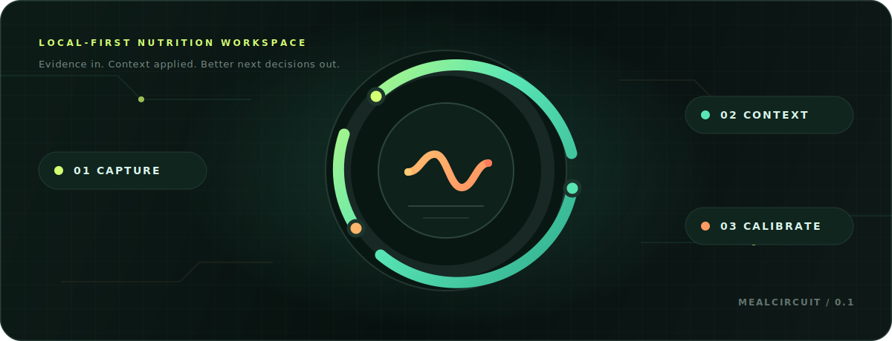

<p align="center">
  
</p>

<h1 align="center">MealCircuit · 食回路</h1>

<p align="center"><strong>记录一餐，不是为了追逐一个数字，而是为了校准下一次选择。</strong></p>

<p align="center">
  <a href="#-三分钟启动">快速开始</a>
  ·
  <a href="#-它如何工作">工作方式</a>
  ·
  <a href="#-agent-工作流">Agent 工作流</a>
  ·
  <a href="#-数据与边界">数据边界</a>
</p>

<p align="center">
  <a href="https://github.com/QianQIUlp/meal-circuit/releases/tag/v0.1.0"></a>
  
  
  <a href="https://github.com/QianQIUlp/meal-circuit/actions/workflows/test.yml"></a>
  <a href="LICENSE"></a>
</p>

MealCircuit 是一个**本地优先、Agent-in-the-loop** 的长期饮食反馈工作台。它把餐食照片、原材料、每日状态问答、食品营养库和用户更正串成一条可追溯的反馈回路，再结合近 14 天趋势、长期记忆与个人总纲，生成结构化判断和下一日菜单。

> [!IMPORTANT]
> MealCircuit 自身不调用外部模型 API，也不要求 API Key。它负责保存事实、组装上下文和校验结果；Codex、Claude Code 或其他 Agent 负责在用户发起任务后完成分析。

## ✦ 不只是卡路里记录

| 证据优先 | 上下文优先 | 主权优先 |
| :--- | :--- | :--- |
| 照片中看不见的油、酱汁、重量和品牌会被明确标为未知，不用伪精确换取确定感。 | 每次判断都读取个人总纲、近 14 天记录、长期记忆和当前调整，不孤立评价某一餐。 | 数据默认保存在仓库外的本机 SQLite 目录；无账户、无遥测、无默认云同步。 |

## ⚡ 三分钟启动

环境要求：**Python 3.11+**。Windows 可直接使用仓库内 PowerShell 脚本，运行时不需要第三方 Python 包。

```powershell
git clone https://github.com/QianQIUlp/meal-circuit.git
cd meal-circuit

python -m mealcircuit.agent_cli init
python -m mealcircuit.agent_cli doctor
.\start.ps1
```

打开 [http://127.0.0.1:8765](http://127.0.0.1:8765)。首次初始化后，按 `doctor` 显示的位置填写私人 `profile.md` 与 `settings.json`；停止服务使用 `Ctrl+C`。

## ◎ 它如何工作


所有分析结果都经过 JSON Schema 级别的结构校验后才会写入。原始输入与既有结果不会被静默覆盖，用户更正会作为新历史追加。

## ◈ 产品界面

| 入口 | 解决的问题 |
| :--- | :--- |
| **今日建议** | 汇总当天状态，查看核心建议、风险信号与次日三餐菜单 |
| **今日状态** | 通过逐题卡片记录体重、训练、饥饿饱腹、睡眠和肠胃反应；支持草稿、跳过和版本历史 |
| **食物照片** | 上传真实餐食，由 Agent 按可见证据估算营养区间并列出未知项 |
| **原材料分析** | 结合食品库中的用户数据，判断食材用途、份量与风险 |
| **食品营养库** | 管理品牌标签、默认份量、优先级、使用条件及历史版本 |
| **记录与记忆** | 保存每日饮食、长期趋势、当前调整和复盘版本历史 |

每日菜单固定覆盖早餐、午餐、晚餐、条件加餐、训练日调整和肠胃异常调整。启用私人设置中的 `home_cooking` 后，早餐转为低摩擦组装、午餐适配食堂或外食、晚餐提供一人份新手执行卡，并同时给出采购清单、网购筛选关键词和三日食材复用方向。系统读取近 14 天已完成晚餐，默认轮换菜式和主风味；确因恢复、临期食材或采购限制重复时必须说明原因。高优先级食品仍须逐项给出 `use` 或 `skip`，不会因为“优先”二字机械塞进菜单。

“今日状态”默认显示五个每日模块。每次只回答一个问题，单题草稿会自动保留；完成整个模块后，答案才会进入 Agent 上下文并重新排队当日复盘。模块可以在“调整模块”中隐藏、排序或改为按需记录。明确跳过只表示用户不提供，系统不会据此推断“未训练”或“没有症状”。

## ⌁ Agent 工作流

待办统一从 CLI 读取。照片与原材料使用任务上下文；每日复盘使用日期上下文。

```powershell
# 1. 查看照片、原材料与每日复盘待办
python -m mealcircuit.agent_cli pending

# 2a. 处理照片 / 原材料任务
python -m mealcircuit.agent_cli context <任务ID> --output context.json
python -m mealcircuit.agent_cli schema photo
python -m mealcircuit.agent_cli complete <任务ID> --file result.json

# 2b. 处理每日复盘
python -m mealcircuit.agent_cli day-context 2026-01-01 --output context.json
python -m mealcircuit.agent_cli schema daily
python -m mealcircuit.agent_cli day-complete 2026-01-01 --file result.json

# 3. 追加用户确认的更正，不覆盖原始结果
python -m mealcircuit.agent_cli correct <任务ID> --text "用户确认的更正"
```

Agent 应严格遵循上下文中的 `doctrine.content` 与 `result_schema`。每日复盘还必须读取 `target_checkin`、`checkin_coverage` 和 `recent_checkins`；草稿不会被导出，跳过与缺失保持未知。照片分析使用营养区间；无法判断的区间为 `null`，不可见信息进入 `unknowns`。

独居模式还会在 `day-context` 中提供 `home_cooking_preferences`、`recent_home_dinners`、`recent_online_categories` 和生成协议。网购建议只描述规格、配料筛选标准与搜索关键词，不执行外部查询，也不声称具体商品的价格或库存。

## ⛨ 数据与边界

运行数据不会写入源码仓库：

| 系统 | 默认私人数据目录 |
| :--- | :--- |
| Windows | `%LOCALAPPDATA%\MealCircuit` |
| macOS | `~/Library/Application Support/MealCircuit` |
| Linux | `$XDG_DATA_HOME/mealcircuit` 或 `~/.local/share/mealcircuit` |

可用 `MEALCIRCUIT_HOME` 修改整个私人目录，或分别通过 `MEALCIRCUIT_DB` 与 `MEALCIRCUIT_PORT` 覆盖数据库路径和端口。

<details>
<summary><strong>从旧版 DietOS 安全迁移</strong></summary>

先预览，再执行复制：

```powershell
python -m mealcircuit.agent_cli migrate-data --from-repo <旧工程路径>
python -m mealcircuit.agent_cli migrate-data --from-repo <旧工程路径> --apply
```

迁移只复制数据，不删除源文件；数据库使用 SQLite Backup API，并校验完整性、表行数和逻辑摘要。

</details>

### 当前真实边界

- Web UI 默认只监听回环地址；`--allow-remote` 不会增加认证或 TLS，不建议暴露到公网。
- 上传只创建待办，不会在后台自动识别照片或生成菜单。
- 当前没有用户账户、云同步、移动端、包装 OCR 或外部营养数据库。
- 使用云端 Agent 时，上下文与图片可能发送给对应模型服务商，请按其数据政策判断。
- MealCircuit 提供一般性记录与决策支持，不构成医疗诊断或治疗建议。

## ⌘ 开发与验证

```powershell
.\test.ps1
python tools\release_check.py
```

测试覆盖数据持久化、状态问答草稿与版本、上下文组装、结果校验、防覆盖、每日复盘、优先食品裁决、HTTP 关键路径和开源发布边界。项目坚持 Python 标准库方案，依赖或架构变化需要单独评估。

```text
mealcircuit/   应用、数据、校验、服务与 CLI
rules/         公开核心规则
templates/     私人配置初始化模板
tests/         单元与 HTTP 集成测试
tools/         发布前隐私与边界检查
```

## License

[MIT](LICENSE) · [隐私说明](PRIVACY.md) · [安全策略](SECURITY.md) · [贡献指南](CONTRIBUTING.md) · [免责声明](DISCLAIMER.md)

<p align="center"><sub>Capture the meal. Keep the context. Calibrate the next choice.</sub></p>
